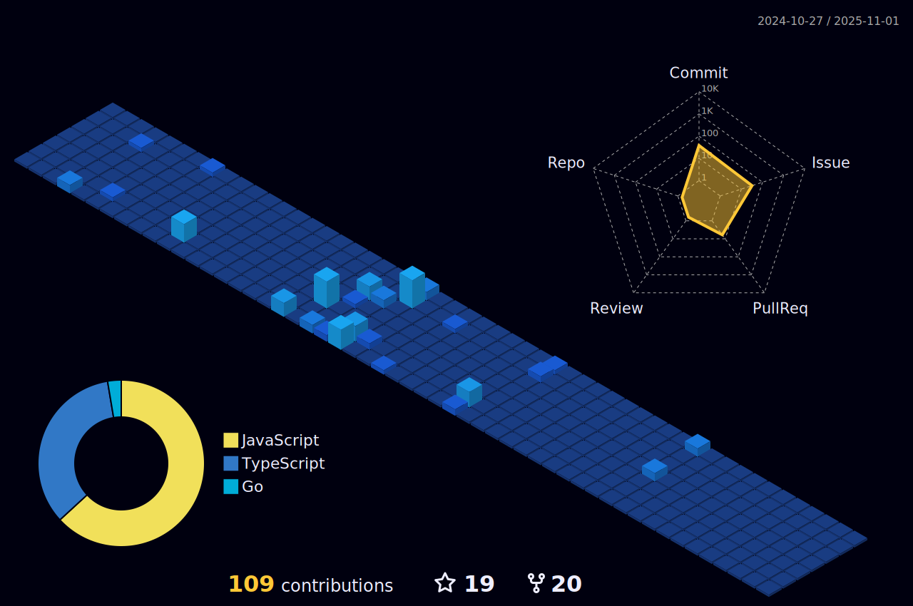

    

      
        
    
   

    

<h3 align="center">Languages and Tools :100:</h3>

    
    
    
    
    
    
    
    
    
    
    
    
    

<h3 align="center">My coding activity :airplane:</h3>

    

